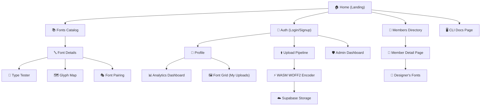

<div align="center">

```
███╗   ██╗ ██████╗ ██████╗  █████╗ ██████╗ ███████╗ ██████╗ ███╗   ██╗████████╗███████╗
████╗  ██║██╔═══██╗██╔══██╗██╔══██╗██╔══██╗██╔════╝██╔═══██╗████╗  ██║╚══██╔══╝██╔════╝
██╔██╗ ██║██║   ██║██████╔╝███████║██║  ██║█████╗  ██║   ██║██╔██╗ ██║   ██║   ███████╗
██║╚██╗██║██║   ██║██╔══██╗██╔══██║██║  ██║██╔══╝  ██║   ██║██║╚██╗██║   ██║   ╚════██║
██║ ╚████║╚██████╔╝██████╔╝██║  ██║██████╔╝██║     ╚██████╔╝██║ ╚████║   ██║   ███████║
╚═╝  ╚═══╝ ╚═════╝ ╚═════╝ ╚═╝  ╚═╝╚═════╝ ╚═╝      ╚═════╝ ╚═╝  ╚═══╝   ╚═╝   ╚══════╝
```

### *"Because Comic Sans deserves to stay in 2003."*

<br/>

[](https://www.typescriptlang.org/)
[](https://react.dev/)
[](https://vitejs.dev/)
[](https://tailwindcss.com/)
[](https://supabase.com/)
[](https://capacitorjs.com/)
[](https://greensock.com/gsap/)
[](LICENSE)
[](https://nobadfonts.in)

<br/>

> 🔤 **NoBadFonts** is a next-generation, curated font discovery platform built for designers who demand quality, context, and performance — across web, Android, and iOS.

<br/>

[🌐 Visit the Site](https://nobadfonts.in) · [📦 Try the CLI](#-cli-companion) · [🐛 Report a Bug](https://github.com/Bismay-exe/nobadfonts/issues)

</div>

---

## 📖 Table of Contents

- [🎯 What Is This?](#-what-is-this)
- [✨ Features](#-features)
- [📸 Screenshots](#-screenshots)
- [🗺️ App Structure Diagram](#️-app-structure-diagram)
- [🏗️ Architecture Overview](#️-architecture-overview)
- [⚙️ Tech Stack](#️-tech-stack)
- [🎨 Color Palette](#-color-palette)
- [💾 Database Schema](#-database-schema)
- [📂 Project Structure](#-project-structure)
- [🚀 Getting Started](#-getting-started)
- [📱 Mobile (Capacitor)](#-mobile-capacitor)
- [🔌 CLI Companion](#-cli-companion)
- [❓ FAQ](#-faq)
- [🛣️ Roadmap](#️-roadmap)
- [🖥️ Self-Hosting](#️-self-hosting)
- [🤝 Contributing](#-contributing)
- [📄 License](#-license)

---

## 🎯 What Is NoBadFonts?

The internet has a font problem. **Too many fonts. Too little curation. Zero context.**

You open Google Fonts, see 1,400+ options, type "Hello World" in a tiny box, and somehow have to make a decision that'll define your entire brand. That's broken.

**NoBadFonts fixes this.** It's a curated typography platform at [nobadfonts.in](https://nobadfonts.in) where:

- 🎨 **Fonts are previewed the way they'll actually be used** — in dashboards, editorial layouts, and code editors
- 🤖 **Every font has a real, generated description** — not "beautiful, modern, versatile" filler copy
- ⚡ **Uploads are optimized in your browser** via WebAssembly WOFF2 conversion before hitting the server
- 📱 **The full experience works natively on Android and iOS** via Capacitor
- 🖥️ **Developers can install fonts directly from the terminal** with the companion CLI

This isn't a font gallery. It's a complete typography toolchain for people who take type seriously.

---

## ✨ Features

### 🔬 Context-Aware Type Tester

```
┌──────────────────────────────────────────────────────────────┐
│  Preview Mode:  [ UI / Dashboard ]  [ Editorial ]  [ Code ]  │
│                                                              │
│  ┌─────────────┐   Typography in context,                    │
│  │  Dashboard  │   not in a vacuum.                          │
│  │  Widget     │                                             │
│  └─────────────┘   No more guessing if Inter looks           │
│                    good in a tooltip. Just... see it.        │
└──────────────────────────────────────────────────────────────┘
```

The `FontTester.tsx` component lets you preview fonts in **three real-world contexts**:

| Mode | Description |
|------|-------------|
| 🖥️ **UI / Dashboard** | Buttons, tooltips, tables — the full product-design context |
| 📰 **Editorial** | Dense, multi-column text for readability testing |
| 💻 **Code** | Monospace fonts in a syntax-highlighted block |

---

### ⚡ Browser-Side WOFF2 Conversion

The upload pipeline (`src/pages/Upload.tsx`) is where things get serious. Before a font even leaves your browser:

```
User uploads .ttf / .otf
         │
         ▼
  ┌──────────────┐
  │  Validation  │  ← Checks metadata, file type, required fields
  └──────┬───────┘
         │
         ▼
  ┌──────────────┐
  │ Fingerprint  │  ← Generates unique slug (e.g. "helvetica-now-display")
  └──────┬───────┘
         │
         ▼
  ┌──────────────────────┐
  │  WASM WOFF2 Encoder  │  ← Runs wawoff2 (Google's woff2 port) IN THE BROWSER
  └──────┬───────────────┘
         │
         ▼
  ┌──────────────────────────────────────┐
  │  Upload Compressed WOFF2 to Supabase │  ← Smaller. Faster. Better.
  └──────────────────────────────────────┘
```

> ✅ Users upload raw fonts. Servers receive optimized WOFF2. The network and your end-users thank you.

---

### 🧠 Algorithmic Description Engine

No more "A beautiful, modern, versatile typeface" placeholder copy. The engine at `src/utils/fontDescriptionGenerator.ts` analyzes a font's actual tag set and synthesizes something real:

```typescript
// Input
tags: ['sans', 'geometric', 'modern', 'bold']

// Output
"A geometric sans-serif with a modern character.
 Its bold weight makes it ideal for headlines and branding."
```

Each description is unique to the font's personality. Curated at scale.

---

### 🎭 Font Pairing Engine

Stop guessing which fonts go together. The pairing interface (`src/pages/FontPairing.tsx`) lets you:
- Browse curated pairing recommendations
- Customize heading + body combinations in a live preview
- Filter by mood, category, and contrast style

---

### 🗺️ Glyph Map

See every character a font supports — before you commit. The `GlyphMap.tsx` component renders the full Unicode coverage of any typeface, so you know if it handles your language, symbols, or edge cases.

---

### 📊 Designer Analytics Dashboard

Uploaders get a private `AnalyticsDashboard.tsx` showing:
- Total views and downloads per font
- Geographic breakdown of interest
- Trending performance over time

---

### 📋 Feature Status at a Glance

| Feature | Description | Status |
|---------|-------------|--------|
| 🔬 Context-Aware Type Tester | Preview fonts in UI, Editorial & Code contexts | ✅ Live |
| ⚡ Browser WOFF2 Conversion | WASM-powered TTF → WOFF2 before upload | ✅ Live |
| 🧠 Algorithmic Description Engine | Auto-generates font copy from metadata tags | ✅ Live |
| 🎭 Font Pairing Engine | Smart heading + body pairing suggestions | ✅ Live |
| 🗺️ Glyph Map Viewer | Full Unicode coverage display | ✅ Live |
| 📊 Analytics Dashboard | Views, downloads & geo stats per font | ✅ Live |
| 📱 iOS & Android (Capacitor) | Native mobile with shared codebase | ✅ Live |
| 🖥️ CLI Tool | `npx nobadfonts-cli add <font>` | ✅ Live |
| 🌐 Edge-generated `fonts.css` | Remote embedding via Supabase Edge Functions | 🚧 Planned |
| 🤖 AI Font Recommendations | Personalized discovery via ML | 🚧 Planned |
| 🎛️ Variable Font Axis Controls | Live weight/width sliders in the type tester | 🚧 Planned |
| 🌙 Dark Mode | System-aware theme toggle | 🚧 Planned |

---

### 🔐 Role-Based Access Control

| Role | Powers |
|------|--------|
| 👤 `member` | Upload fonts, manage their own library |
| 🛡️ `admin` | Global curation rights, publish/unpublish any font, run `FixWoff2Scanner` |

Enforced at the database level via **Supabase Row Level Security (RLS)** — not just in the UI.

---

---

## 📸 Screenshots

> 🌐 Live at **[nobadfonts.in](https://nobadfonts.in)** — visit to see it in action.

**🏠 Landing Page**


**🔤 Font Catalog**


**🔬 Context-Aware Type Tester**


**📱 Mobile View (Capacitor)**


---

## 🗺️ App Structure Diagram

A high-level map of every page and how they connect:



---

## 🏗️ Architecture Overview

```
┌─────────────────────────────────────────────────────────────────────┐
│                         NoBadFonts Platform                         │
│                                                                     │
│   ┌─────────────┐    ┌──────────────┐    ┌──────────────────────┐   │
│   │   Web App   │    │ Android App  │    │      iOS App         │   │
│   │  (Vite +    │    │ (Capacitor)  │    │   (Capacitor)        │   │
│   │   React 19) │    │              │    │                      │   │
│   └──────┬──────┘    └──────┬───────┘    └──────────┬───────────┘   │
│          │                  │                        │              │
│          └──────────────────┼────────────────────────┘              │
│                             │ Shared React Codebase (99%)           │
│                             ▼                                       │
│   ┌───────────────────────────────────────────────────────────┐     │
│   │                   React 19 + TypeScript                   │     │
│   │                                                           │     │
│   │   AuthContext ──► Supabase Auth                           │     │
│   │   UploadContext ──► WASM WOFF2 Queue                      │     │
│   │   Lenis + GSAP ──► Scroll Animations                      │     │
│   │   Framer Motion ──► Micro-interactions                    │     │
│   └───────────────────────┬───────────────────────────────────┘     │
│                           │                                         │
│                           ▼                                         │
│   ┌───────────────────────────────────────────────────────────┐     │
│   │                  Supabase Backend                         │     │
│   │                                                           │     │
│   │   PostgreSQL ──► fonts, profiles, font_variants           │     │
│   │   Storage ──► Font files (.woff2, .ttf, .otf)             │     │
│   │   RLS Policies ──► Row-level auth enforcement             │     │
│   │   Edge Functions ──► (Future) fonts.css generation        │     │
│   └───────────────────────────────────────────────────────────┘     │
│                                                                     │
└─────────────────────────────────────────────────────────────────────┘
```

---

## ⚙️ Tech Stack

### Frontend

| Technology | Version | Role |
|------------|---------|------|
| **React** | 19 RC | Core UI framework |
| **TypeScript** | 5.x | Type safety across the entire codebase |
| **Vite** | Latest | Build tool — instant HMR, optimized bundles |
| **Tailwind CSS** | v4 (Alpha) | Styling — new engine, sub-ms compile times |
| **Framer Motion** | Latest | Layout animations, modal transitions |
| **GSAP + Lenis** | Latest | Smooth scroll parallax effects |

### Backend & Infrastructure

| Technology | Role |
|------------|------|
| **Supabase** | PostgreSQL + Auth + Storage + RLS |
| **Vercel** | Web deployment + edge CDN |
| **Capacitor** | iOS & Android native bridge |

### Unique Capabilities

| Technology | What It Does |
|------------|--------------|
| **`wawoff2` (WASM)** | Converts TTF → WOFF2 *in the browser* before upload |
| **Algorithmic Desc. Engine** | Synthesizes font descriptions from metadata tags |
| **Supabase RLS** | Database-level auth, not just UI-level |

---

## 🎨 Color Palette

The NoBadFonts design system is built around a high-contrast, type-forward aesthetic:

| Role | Color | Hex | Used For |
|------|-------|-----|---------|
| Background |  | `#0f0f0f` | Page backgrounds |
| Surface |  | `#1a1a1a` | Cards, modals |
| Primary Text |  | `#f5f5f5` | Headlines, body copy |
| Accent |  | `#ffffff` | CTAs, highlights |
| Muted |  | `#6b7280` | Secondary text, tags |
| Success |  | `#3ecf8e` | Published status, Supabase integration |

---

## 💾 Database Schema

### `profiles`

```sql
CREATE TABLE profiles (
  id         UUID PRIMARY KEY REFERENCES auth.users,
  username   TEXT UNIQUE NOT NULL,
  role       TEXT DEFAULT 'member' CHECK (role IN ('member', 'admin')),
  avatar_url TEXT,
  created_at TIMESTAMPTZ DEFAULT NOW()
);
```

### `fonts`

```sql
CREATE TABLE fonts (
  id           UUID PRIMARY KEY DEFAULT gen_random_uuid(),
  slug         TEXT UNIQUE NOT NULL,
  name         TEXT NOT NULL,
  user_id      UUID REFERENCES profiles(id),
  tags         TEXT[],
  category     TEXT,
  designer     TEXT,
  is_published BOOLEAN DEFAULT FALSE,
  created_at   TIMESTAMPTZ DEFAULT NOW()
);
```

### `font_variants`

```sql
CREATE TABLE font_variants (
  id              UUID PRIMARY KEY DEFAULT gen_random_uuid(),
  font_id         UUID REFERENCES fonts(id) ON DELETE CASCADE,
  variant_name    TEXT NOT NULL,        -- e.g. "Bold Italic"
  woff2_url       TEXT,                 -- CDN link to compressed file
  ttf_url         TEXT,
  file_size_woff2 BIGINT,               -- For analytics
  created_at      TIMESTAMPTZ DEFAULT NOW()
);
```

### RLS at a Glance

```
fonts table:
  ✅ Anyone can SELECT published fonts
  ✅ Authenticated users can INSERT their own fonts
  ✅ Users can UPDATE/DELETE only their own rows
  ✅ Admins have unrestricted access
```

---

## 📂 Project Structure

```
nobadfonts/
│
├── 📁 .github/workflows/        # CI/CD pipelines
├── 📁 android/                  # Capacitor Android project
├── 📁 logo/                     # Brand assets
│
├── 📁 nobadfonts-cli/           # ← Standalone CLI package
│   └── README.md
│
├── 📁 public/                   # Static assets
├── 📁 scripts/                  # Utility scripts
├── 📁 supabase/                 # DB migrations & edge functions
│
└── 📁 src/
    │
    ├── 📁 components/
    │   ├── 📁 admin/
    │   │   └── FixWoff2Scanner.tsx    # Admin tool: scan & fix broken woff2 refs
    │   │
    │   ├── 📁 font-pairing/
    │   │   ├── CustomizeSidebar.tsx   # Live font pair customizer
    │   │   └── FontPickerSidebar.tsx  # Browse & pick fonts for pairing
    │   │
    │   ├── 📁 fonts/
    │   │   ├── ContextPreview.tsx     # UI / Editorial / Code preview modes
    │   │   ├── Filters.tsx            # Tag + category filtering
    │   │   ├── FontCard.tsx           # Card component in catalog grid
    │   │   ├── FontTester.tsx         # Interactive type tester
    │   │   ├── GlyphMap.tsx           # Full Unicode glyph coverage viewer
    │   │   ├── LicenseInfo.tsx        # License display
    │   │   ├── PreviewAccordion.tsx   # Expandable preview panel
    │   │   ├── ShareModal.tsx         # Share font link modal
    │   │   └── SocialShareCard.tsx    # OG card generator
    │   │
    │   ├── 📁 home/
    │   │   ├── 📁 Hero/               # Hero section variants (1, 2, 4)
    │   │   ├── Land2.tsx ... Land8.tsx # Landing page sections
    │   │   └── Landing.tsx
    │   │
    │   ├── 📁 layout/
    │   │   ├── Footer.tsx
    │   │   ├── Layout.tsx
    │   │   ├── Navbar.tsx
    │   │   └── ScrollRestoration.tsx
    │   │
    │   ├── 📁 profile/
    │   │   ├── AnalyticsDashboard.tsx # Font performance stats
    │   │   ├── FontGrid.tsx           # Profile's uploaded fonts
    │   │   ├── ProfileHeader.tsx
    │   │   └── SettingsForm.tsx
    │   │
    │   ├── 📁 shared/
    │   │   ├── EmptyState.tsx
    │   │   ├── ErrorBoundary.tsx
    │   │   └── SEO.tsx
    │   │
    │   └── UploadProgressPopup.tsx    # Background upload progress indicator
    │
    ├── 📁 contexts/
    │   ├── AuthContext.tsx            # Supabase auth state: user, session, profile
    │   └── UploadContext.tsx          # WOFF2 conversion queue management
    │
    ├── 📁 hooks/
    │   ├── useFont.ts                 # Single font data fetching
    │   ├── useFonts.ts                # Catalog data fetching with filters
    │   ├── useLenis.ts                # Smooth scroll → GSAP ScrollTrigger bridge
    │   ├── useMediaQuery.ts           # Responsive breakpoint detection
    │   └── useViewMode.ts             # Grid vs list view toggle
    │
    ├── 📁 pages/
    │   ├── AdminDashboard.tsx         # Admin-only moderation panel
    │   ├── Auth.tsx                   # Login / signup
    │   ├── Cli.tsx                    # CLI documentation page
    │   ├── DesignerFonts.tsx          # Fonts filtered by designer
    │   ├── FontDetails.tsx            # Full font detail page
    │   ├── FontPairing.tsx            # Pair fonts interactively
    │   ├── FontsCatalog.tsx           # Main browsable catalog
    │   ├── Home.tsx                   # Landing page
    │   ├── MemberDetails.tsx          # Public profile view
    │   ├── Members.tsx                # Community directory
    │   ├── Profile.tsx                # Private user profile
    │   └── Upload.tsx                 # Multi-stage upload pipeline
    │
    ├── 📁 types/
    │   ├── database.types.ts          # Supabase-generated DB types
    │   └── font.ts                    # FontVariant, FontData interfaces
    │
    ├── 📁 utils/
    │   ├── fontDescriptionGenerator.ts # Algorithmic description synthesis
    │   └── woff2.ts                    # WASM WOFF2 encoder wrapper
    │
    ├── App.tsx
    ├── fonts.css                       # @font-face declarations
    ├── index.css
    └── main.tsx
```

---

## 🚀 Using NoBadFonts

**NoBadFonts is a live product at [nobadfonts.in](https://nobadfonts.in).** No setup needed — just open it in your browser.

| What you want to do | Where to go |
|---------------------|-------------|
| 🔤 Browse & preview fonts | [nobadfonts.in/fonts](https://nobadfonts.in) |
| 🎭 Pair fonts together | [nobadfonts.in/pairing](https://nobadfonts.in) |
| ⬆️ Upload your typeface | Create a free account, then hit Upload |
| 🖥️ Use fonts in your project via CLI | See [CLI Companion](#-cli-companion) below |
| 📱 Use on mobile | Download the Android / iOS app |

---

## 🖥️ Self-Hosting

The source code is open — if you want to run your own instance, here's how.

### Prerequisites

```
Node.js  ≥ 20.x
npm      ≥ 10.x   (or pnpm)
```

### Setup

```bash
# Install dependencies
npm install

# Configure environment
cp .env.example .env
```

Add your Supabase credentials to `.env`:

```env
VITE_SUPABASE_URL=https://your-project-ref.supabase.co
VITE_SUPABASE_ANON_KEY=your_supabase_anon_key
```

> 💡 Get these from your [Supabase Dashboard](https://app.supabase.com) → Project Settings → API

```bash
# Start dev server
npm run dev
# → http://localhost:5173

# Build for production
npm run build
```

---

## 📱 Mobile (Capacitor)

NoBadFonts runs natively on Android and iOS using Capacitor. 99% of the codebase is shared.

### Android

```bash
# Sync the web build into the native project
npx cap sync

# Open in Android Studio
npx cap open android
```

### iOS

```bash
npx cap sync
npx cap open ios   # Requires macOS + Xcode
```

### Native Plugins Used

| Plugin | Purpose |
|--------|---------|
| `@capacitor/filesystem` | Read/write font files locally |
| `@capacitor/haptics` | Tactile feedback on interactions |

---

## 🔌 CLI Companion

For developers who prefer living in the terminal, NoBadFonts ships with a companion CLI.

```bash
# Install globally
npm install -g nobadfonts-cli

# Add a font to your project
npx nobadfonts-cli add inter

# List all available curated fonts
npx nobadfonts-cli list

# Search by category
npx nobadfonts-cli search --category="geometric-sans"
```

The CLI automatically downloads the WOFF2 file, injects the `@font-face` declaration into your `fonts.css`, and keeps everything organized.

> 📖 Full docs: [`nobadfonts-cli/README.md`](./nobadfonts-cli/README.md)

---

## ❓ FAQ

**Q: Is NoBadFonts free to use?**
> Yes — browsing, previewing, and discovering fonts is completely free. Creating an account to upload your own typefaces is also free.

**Q: What font formats can I upload?**
> `.ttf`, `.otf`, `.woff`, and `.woff2` are all accepted. If you upload a `.ttf` or `.otf`, NoBadFonts automatically converts it to `.woff2` in your browser before uploading — so your fonts load faster for everyone.

**Q: Can I use the fonts I find here in commercial projects?**
> License information is shown on every font's detail page. Always check the specific font's license before using it in commercial work.

**Q: How does the CLI work?**
> Install it with `npm install -g nobadfonts-cli`, then run `npx nobadfonts-cli add <fontname>`. It fetches the WOFF2, writes the `@font-face` rule into your CSS, and you're done in one command.

**Q: Is there a mobile app?**
> Yes — NoBadFonts is available as a native Android and iOS app with the same full feature set as the website.

**Q: I found a bug or have a feature idea. Where do I go?**
> Open an issue on [GitHub Issues](https://github.com/Bismay-exe/nobadfonts/issues) — all feedback is read and considered.

---

## 🛣️ Roadmap

- [x] Context-aware type tester (UI / Editorial / Code modes)
- [x] Browser-side WOFF2 conversion with WASM
- [x] Algorithmic font description generator
- [x] Font pairing engine
- [x] Glyph map viewer
- [x] Capacitor mobile (Android + iOS)
- [x] CLI companion tool
- [x] Admin dashboard with curation tools
- [ ] Supabase Edge Function — generate `fonts.css` for remote embedding
- [ ] AI-powered font recommendation engine
- [ ] Variable font axis controls in the type tester
- [ ] Dark mode
- [ ] Font collections / bookmarks

---

## 🧑‍🤝‍🧑 Contributors

Thanks to everyone who has contributed to NoBadFonts!

<a href="https://github.com/Bismay-exe/nobadfonts/graphs/contributors">
  
</a>

Want to see your avatar here? Check out the [Contributing](#-contributing) section and open a PR!

---

## 📄 License

Distributed under the **MIT License**. See [`LICENSE`](LICENSE) for full text.

---

<div align="center">

Built with 🖤 by [Bismay](https://github.com/Bismay-exe)

**[nobadfonts.in](https://nobadfonts.in) — Stop using bad fonts.**

<br/>

[](https://nobadfonts.in)
[](https://github.com/Bismay-exe/nobadfonts)

</div>